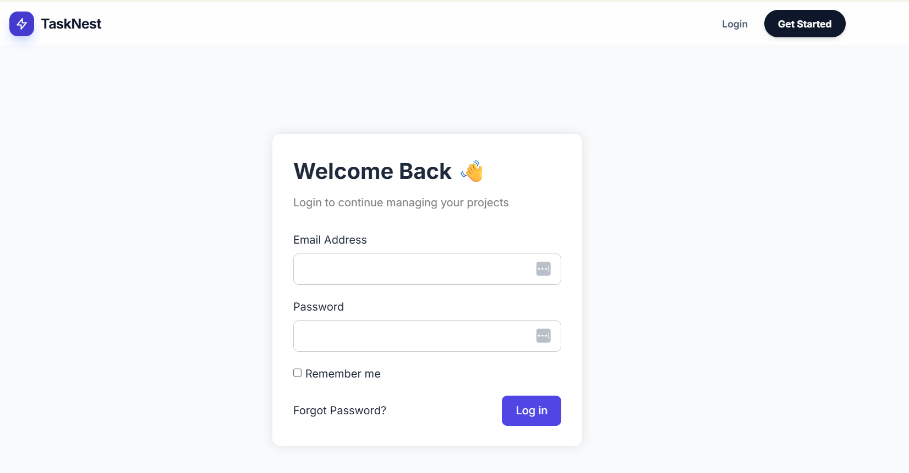
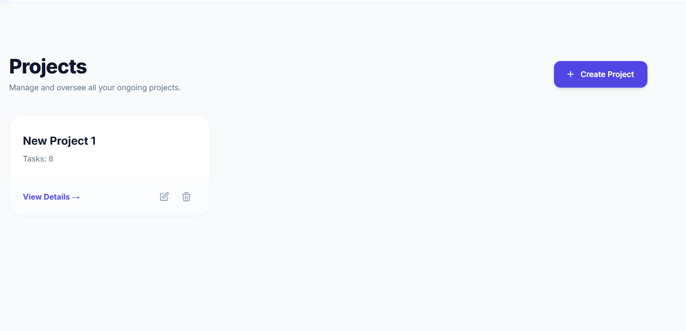
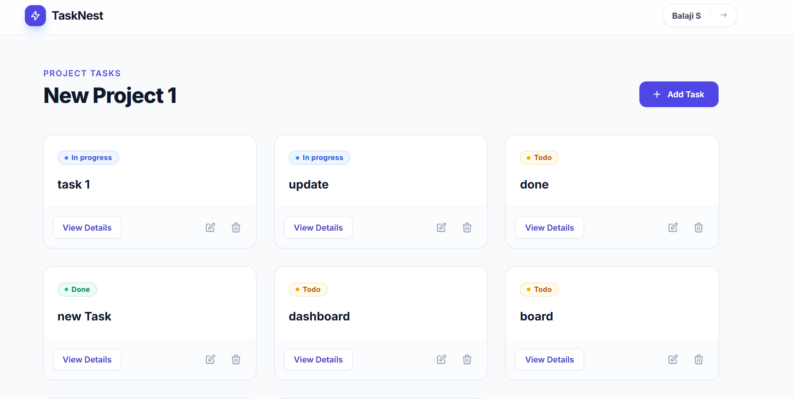
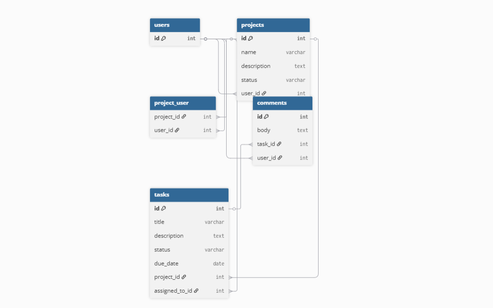

# Laravel Training Scaffold — Student Instructions

This is the starter codebase for the Kalvium 12-Day Laravel Training program.

## What this repo is

This codebase is **intentionally incomplete**. Routes are stubs that throw 501 errors. Models have no relationships. Views are placeholders. Migrations have empty schemas.

Across 12 days, you'll fill in TODO comments aligned with each day's learning topic. By Day 12, this becomes a fully working Task & Project Management System.

## ⚠️ A note on academic honesty

This scaffold was adapted from an existing open-source Laravel project (see Credits at the bottom).
That original repo has a complete, working implementation. **You can find it. Don't.**

Here's why looking at it defeats the entire purpose of this program:

- **The deliverable is not a working app.** The deliverable is YOU, ready to pass a recruiter's technical evaluation.
  A copied app cannot answer "why did you choose this approach?" or "live-code a new endpoint right now."
- **Mock Interview #1 (Day 6)** asks you to live-code an Eloquent relationship on the spot. You cannot fake this.
- **Mock Interview #2 (Day 10)** asks you to add a new endpoint under time pressure and explain your choices. You cannot fake this.
- **The technical evaluation with the actual recruiter** will be similar in format. If you can't pass our mocks, you won't pass theirs.

We trust you. Stuck for 2+ hours? Ask in the cohort channel before going hunting. That's what it's there for.

## Day 1 setup

```bash
# 1. Fork this repo to your own GitHub account, then clone YOUR fork:
git clone https://github.com/YOUR-USERNAME/laravel-training-scaffold.git laravel-training-yourname
cd laravel-training-yourname

# 2. Install dependencies
composer install

# 3. Create environment file
cp .env.example .env
php artisan key:generate

# 4. Create a local MySQL database, then update .env:
#    DB_DATABASE=laravel_training
#    DB_USERNAME=root
#    DB_PASSWORD=...

# 5. Migrate (don't run --seed yet — seeders are TODOs for Day 4!)
php artisan migrate

# 6. Run the app
php artisan serve
# Visit localhost:8000 — you should see the Laravel welcome page
```

If localhost:8000 loads, your Day 1 deliverable is done.

## How to find your daily TODOs

Each day has tagged TODOs throughout the codebase. To see your tasks for the day:

```bash

grep -rn "TODO Day 6"   # for Day 6
# etc.
```

You can also see ALL TODOs at once:

```bash
grep -rn "TODO Day" --include="*.php" --include="*.blade.php"
```

1. Ensure you have your personal GitHub fork ready.


## Daily workflow

1. Open the spreadsheet — find today's row
2. Watch the day's primary video + read docs (≈2 hrs)
3. Run `grep -rn "TODO Day X"` to find your tasks
4. Implement each TODO (≈2 hrs); replace the `// TODO` comment with your code
5. Verify the app still runs: `php artisan serve` and click around
6. Write `docs/day-XX.md` reflection
7. Commit: `git commit -m "day-XX: <focus area>"`
8. Push to your fork

## Day-by-day cheat sheet

| Day | Focus | Files you'll touch |
|---|---|---|
| 1 | Setup | (none — just get it running) |
| 2 | Routes & controllers | routes/web.php, app/Http/Controllers/* |
| 3 | Blade views | resources/views/projects/*, tasks/* |
| 4 | Migrations + seeders | database/migrations/*, database/seeders/* |
| 5 | Eloquent CRUD | app/Models/*, app/Http/Controllers/* |
| 6 | Relationships ⭐ MI #1 | app/Models/* (relationships only) |
| 7 | Validation | app/Http/Requests/* |
| 8 | Auth (install Breeze) | install Breeze; app/Models/User.php |
| 9 | Authorization | app/Policies/*, app/Http/Middleware/CheckRole.php |
| 10 | REST API ⭐ MI #2 | install Sanctum; routes/api.php; app/Http/Resources/* |
| 11 | Files, mail, queues | app/Mail/TaskAssigned.php; storage handling |
| 12 | Tests + deploy | tests/Feature/*; deploy to Laravel Cloud |

## Rules

- **One repo, all 12 days.** Don't create new repos for each day.
- **Daily commits required.** Format: `git commit -m "day-XX: <focus area>"`
- **`docs/day-XX.md` is mandatory** — this is your interview prep material.
- **Don't push to the original scaffold** — you're working in YOUR fork.
- **Stuck >45 min?** Ask in the cohort channel before going deeper.

## Credits

This scaffold was adapted from [Task-management-app---Laravel-10 by UmerFarooq966](https://github.com/UmerFarooq966/Task-management-app---Laravel-10),
used here for educational purposes. Thanks to the original author.

Good luck.


# Laravel Task Management System

A full-stack Laravel-based Task Management System built during a 12-day backend engineering training program.  
This application supports authentication, authorization, task management, REST APIs, file uploads, queued emails, feature testing, and production deployment.

---

# Live Demo

https://laravel-training-scaffold.onrender.com/

---

# Features

- User Authentication
- Authorization Policies
- Project CRUD Operations
- Task CRUD Operations
- Task Assignment
- Queued Email Notifications
- File Upload Support
- REST API Endpoints
- Sanctum Authentication
- Feature Testing
- PostgreSQL Production Database
- Docker Deployment
- Production Deployment on Render

---

# Tech Stack

- Laravel 12
- PHP 8.2
- PostgreSQL
- Laravel Sanctum
- Blade Templates
- Tailwind CSS
- Vite
- Docker
- Render
- Mailtrap
- PHPUnit

---

# Screenshots

## Home Page


## Login Page

## Dashboard

## Projects Page

## Tasks Page


## ER Diagram




## Authentication

This project uses Laravel Authentication with:

* Registration
* Login
* Logout
* Session Authentication
* Sanctum Token Authentication

## Authorization

Authorization is implemented using Laravel Policies.

Example:

* Only project owners can update/delete projects
* Only authorized users can manage tasks

## API Endpoints

* Authentication
POST /api/login
* Projects API
GET /api/projects
* Tasks API
GET /api/tasks

## File Uploads

* Users can upload attachments while creating tasks.
* Uploaded files are stored using Laravel Storage.

## Queued Emails

* Task assignment emails are queued using Laravel Queues.

Example:

* When a task is assigned to a user
* Email notification gets queued and processed

## Database Relationships

Relationships implemented:

* User hasMany Projects
* Project hasMany Tasks
* Task belongsTo User
* Task belongsTo Project

## Testing

Feature tests implemented for:

* CRUD operations
* Authentication
* Authorization
* API testing
* Eloquent relationships

## Test Output

PASS  Tests\\Unit\\ExampleTest

PASS  Tests\\Feature\\ApiAuthTest
✓ user can login and receive a token
✓ authenticated request returns user projects

PASS  Tests\\Feature\\AuthorizationTest
✓ guest is redirected to login
✓ admin can access admin routes

PASS  Tests\\Feature\\ProjectCrudTest
✓ authenticated user can view projects
✓ authenticated user can create project
✓ unauthorized users cannot update projects

PASS  Tests\\Feature\\RelationshipTest
✓ project has many tasks
✓ user belongs to many projects

Tests: 33 passed
Deployment

The application is deployed publicly using:

* Docker
* Render
* PostgreSQL

### Local Setup Instructions

Clone Repository
```
git clone https://github.com/YOUR_USERNAME/YOUR_REPO.git
```
Move into Project
```
cd YOUR_REPO
```
Install PHP Dependencies
```
composer install
```
Install Node Dependencies
```
npm install
```
Configure Environment
```
cp .env.example .env
```
Generate Application Key
```
php artisan key:generate
```
Configure Database
```
Update .env with database credentials.
```
Run Migrations
```
php artisan migrate
Run Vite
npm run dev
Start Laravel Server
php artisan serve
```
**Environment Variables Used**
```
APP_NAME=
APP_ENV=
APP_KEY=
APP_DEBUG=

DB_CONNECTION=
DB_HOST=
DB_PORT=
DB_DATABASE=
DB_USERNAME=
DB_PASSWORD=

MAIL_MAILER=
MAIL_HOST=
MAIL_PORT=
MAIL_USERNAME=
MAIL_PASSWORD=
MAIL_ENCRYPTION=

QUEUE_CONNECTION=
```

### Project Structure

```
app/
routes/
resources/
tests/
database/
public/

```
### Concepts Learned

* Laravel MVC Architecture
* REST APIs
* Authentication
* Authorization
* Policies
* Middleware
* Eloquent Relationships
* Queues
* Mailables
* File Uploads
* Feature Testing
* Docker Deployment
* Production Debugging
* PostgreSQL Integration

### Version

v1.0

### GitHub Release Tag
git tag v1.0
git push origin v1.0

### Future Improvements
* Real-time notifications
* Role-based dashboards
* Activity logging
* Search and filters
* WebSockets
* Admin analytics
