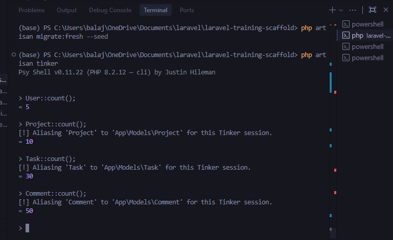

# Day 04 – Database Design & Seeding  

## 1. What did I learn today  

* Learned how to design database schema using Laravel migrations  
* Understood how to define columns, foreign keys, and constraints  
* Got clarity on one-to-many and many-to-many relationships  
* Learned how to use factories with Faker to generate dummy data  
* Understood how seeders populate structured data into the database  
* Learned the importance of migration order (parent → child tables)  
* Understood how to verify data using Tinker  

---

## 2. What worked well / what didn’t  

### ✅ Worked well  

* Creating tables using migrations was straightforward  
* Defining relationships using foreign keys made structure clear  
* Using factories helped generate realistic test data easily  
* Running seeders populated data correctly across all tables  
* Verifying data using Tinker confirmed everything is working  

### ⚠️ Didn’t work initially  

* Faced foreign key error because migrations were in wrong order  
* Fixed it by arranging tables based on dependencies (tasks before comments)  
* Got error “Factory not found” because factory files were missing  
* Fixed by creating factories using artisan commands  
* Faced namespace error in seeder due to missing model imports  
* Fixed by adding `use App\Models\...`  

---

## 3. Blockers  

* Understanding migration order and table dependencies took time  
* Initially confused about how to distribute data across related tables  
* Faced difficulty in connecting factories with seeders correctly  
* Debugging foreign key and factory errors required careful checking  

---

## 4. Database Structure  

| Table | Relationship | Description |
|------|-------------|------------|
| users | has many projects | Default Laravel user table |
| projects | belongs to user | Each project owned by a user |
| tasks | belongs to project | Tasks under each project |
| comments | belongs to task & user | Comments on tasks |
| project_user | many-to-many | Users assigned to projects |

---

## 5. Data Verification  

```php
User::count();     // 5
Project::count();  // 10
Task::count();     // 30
Comment::count();  // 50

```

## 6. ER Diagram

```mermaid
erDiagram
    users ||--o{ projects : owned_by
    users ||--o{ comments : written_by
    projects ||--o{ tasks : contains
    tasks ||--o{ comments : has
    projects ||--o{ users : assigned_to

    users {
        int id PK
        string name
        string email
        string password
    }

    projects {
        int id PK
        string name
        string description
        string status
        int user_id FK
    }

    tasks {
        int id PK
        string title
        string description
        string status
        date due_date
        int project_id FK
        int assigned_to_id FK
    }

    comments {
        int id PK
        text body
        int user_id FK
        int task_id FK
    }

    project_user {
        int project_id FK
        int user_id FK
        PRIMARY KEY (project_id, user_id)
    }
```

## 7. Final Status

* All tables created with proper relationships  
* 5 users, 10 projects, 30 tasks, 50 comments seeded  
* Factories generate realistic dummy data  
* Migrations run successfully in correct order  
* Data verified using Tinker  
* Database structure is ready for next phase  

