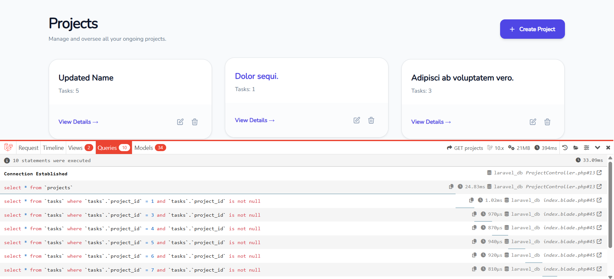
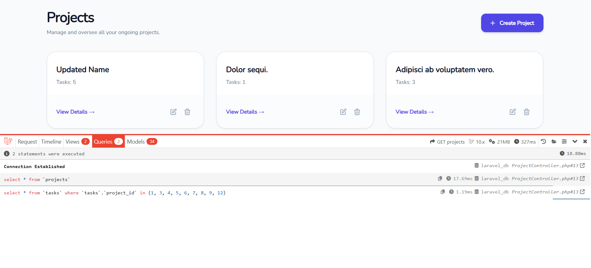

# Day 06 – Eloquent Relationships & N+1 Optimization

## Tasks Completed

* Implemented Eloquent relationships:
  - Project → hasMany → Tasks
  - Task → hasMany → Comments
  - Task → belongsTo → User (assignee)
  - Project ↔ User → belongsToMany (members)
* Displayed nested data:
  - Project → Tasks → Comments
  - Project → Members
* Installed Laravel Debugbar
* Identified N+1 problem
* Fixed N+1 using eager loading (with())

---

## What I Learned

* How relationships work in Laravel (hasMany, belongsTo, belongsToMany)
* How nested data is fetched and displayed
* What N+1 problem is and why it occurs
* How to use Debugbar to analyze queries
* How eager loading improves performance

---

## N+1 Problem (Before vs After)

### Before (Without Eager Loading)

* Used: `Project::all()`
* Accessed: `$project->tasks`
* Result: Multiple queries executed (N+1 problem)

---

### After (With Eager Loading)

* Used: `Project::with('tasks')->get()`
* Result: Queries reduced significantly

---

## Database Relationships

* Project has many Tasks
* Task belongs to Project
* Task has many Comments
* Project belongs to many Users (team members)
* Task belongs to User (assignee)

---

## Final Outcome

* Relationships implemented successfully
* Nested data displayed correctly in UI
* N+1 problem identified and fixed
* Application performance improved